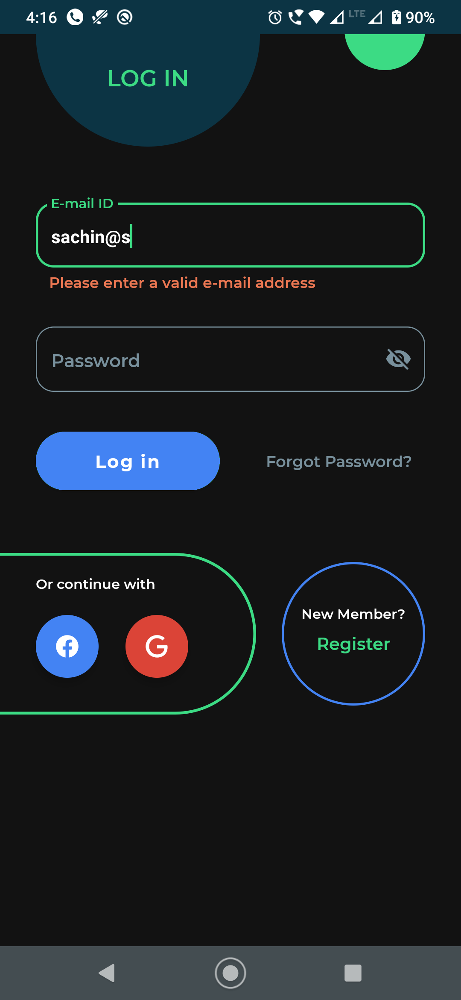
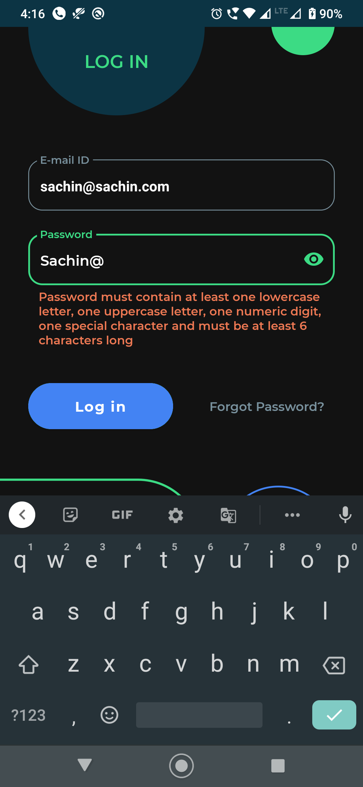
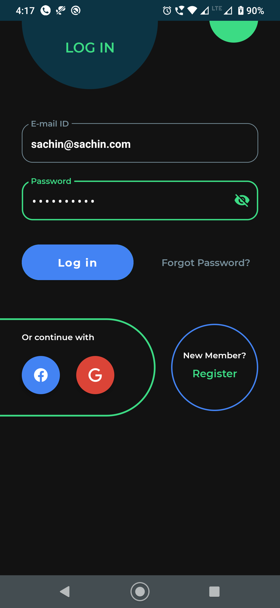

# AwesomeLogin - React Native

Here is a simple, elegant and a beautiful login screen created using react native. Special thanks to [react-native](https://github.com/facebook/react-native) and [react-native-paper](https://github.com/callstack/react-native-paper) package, with the help of which I was able to create this awesome login page.

#### Key Points

-A login page created using react native (react JS).

-It supports the dark mode as well.

-Contains a well commented and organized code.

#### Screenshots

##### Happy coding :)

# License

    Copyright 2021 Sachin Rupani

    Licensed under the Apache License, Version 2.0 (the "License");
    you may not use this file except in compliance with the License.
    You may obtain a copy of the License at

       http://www.apache.org/licenses/LICENSE-2.0

    Unless required by applicable law or agreed to in writing, software
    distributed under the License is distributed on an "AS IS" BASIS,
    WITHOUT WARRANTIES OR CONDITIONS OF ANY KIND, either express or implied.
    See the License for the specific language governing permissions and
    limitations under the License.
